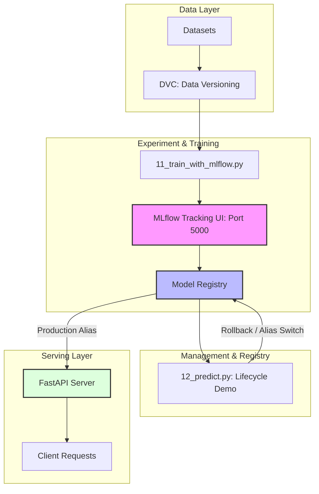

# 🚀 Koreatech MLOps Framework

[](https://mlflow.org/)
[](https://dvc.org/)
[](https://fastapi.tiangolo.com/)
[](https://www.docker.com/)

이 프로젝트는 데이터 관리부터 실험 추적, 모델 레지스트리 관리 및 배포까지 아우르는 **End-to-End MLOps 파이프라인** 예제입니다.

---

## 🏗️ MLOps Architecture

이 프로젝트의 파이프라인 핵심 흐름입니다.



---

## 📂 Project Structure

프로젝트 전반의 구조와 핵심 파일들의 역할입니다.

```text
.
├── src/                        # 파이썬 스크립트 및 핵심 로직
│   ├── 10_train.py             # 기초 학습용 스크립트 (로컬 pkl 저장)
│   ├── 11_train_with_mlflow.py # MLflow 기반 학습 스크립트 (로그 기록 & 모델 등록)
│   ├── 12_predict.py           # 모델 라이프사이클 관리 데모 (별칭 변경 & 롤백)
│   ├── 20_credit_fraud_pipeline_prac.py       # 신용카드 사기 탐지 파이프라인 (연습용 템플릿)
│   ├── 21_credit_fraud_pipeline_prac_done.py  # 신용카드 사기 탐지 파이프라인 (완성본)
│   └── requirements.txt        # 프로젝트 의존 패키지 목록
├── app/                        # 서비스 배포용 코드
│   └── main.py                 # FastAPI 기반 모델 서빙 API (Production 모델 로드)
├── datasets/                   # DVC로 관리되는 데이터셋 저장소
│   ├── iris_data.csv
│   └── credit_fraud_dataset.csv
├── models/                     # 로컬에 저장된 모델 파일 (.pkl)
├── credit_models/              # 신용카드 사기 탐지 모델 로컬 저장소
├── dockers/                    # 컨테이너화를 위한 Docker 설정
│   ├── Dockerfile
│   └── docker-compose.yml
├── mlflow.db                   # MLflow 메타데이터 DB (SQLite)
├── mlartifacts/                # MLflow 모델 및 결과물 저장소
└── README.md                   # 프로젝트 문서 (현재 파일)
```

---

## 🚀 Quick Start

### 1. 환경 설정 및 데이터 준비
```bash
# 패키지 설치
pip install -r src/requirements.txt

# 데이터 가져오기 (DVC 원격 저장소 설정 필요)
dvc pull
```

### 2. 실험 추적 서버 실행 (MLflow)
MLflow UI를 실행하여 실시간으로 실험 결과를 모니터링합니다.
```bash
# 5000번 포트로 UI 실행
mlflow ui --port 5000 --host 0.0.0.0
```

### 3. 모델 학습 및 등록
`11_train_with_mlflow.py`를 실행하면 학습 결과가 기록되고, 최고 성능 모델이 `production` 별칭과 함께 레지스트리에 등록됩니다.
```bash
python src/11_train_with_mlflow.py
```

### 4. 실시간 모델 서빙 (FastAPI)
등록된 `production` 모델을 사용하여 API 서버를 구동합니다.
```bash
uvicorn app.main:app --host 0.0.0.0 --port 8000  --reload
```
@http://localhost:8000/docs
---

## 🛠️ Tech Stack

| Category | Technology | Usage |
| :--- | :--- | :--- |
| **Language** | Python 3.11 | Core Logic |
| **Tracking** | MLflow | Experiment Tracking & Model Registry |
| **Data V** | DVC | Data & Model Artifact Versioning |
| **Framework** | Scikit-learn | Machine Learning Pipeline |
| **API** | FastAPI | Model Serving |
| **Infra** | Docker | Containerization |

---

## 🎯 핵심 기능 요약

> [!TIP]
> **실습 포인트**
> 1. **모델 관리**: `src/12_predict.py`를 통해 모델 버전을 별칭(Alias)으로 관리하고 문제 발생 시 즉시 롤백하는 과정을 실습해 보세요.
> 2. **포트 관리**: MLflow UI는 기본적으로 **5000번** 포트를 사용하도록 설정되어 있습니다.

---
최종 수정일: 2026-04-19